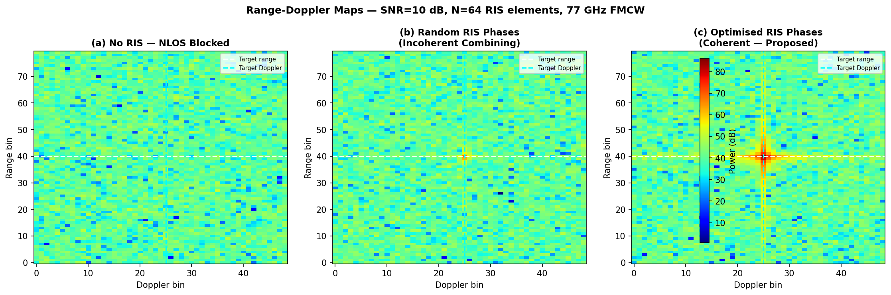
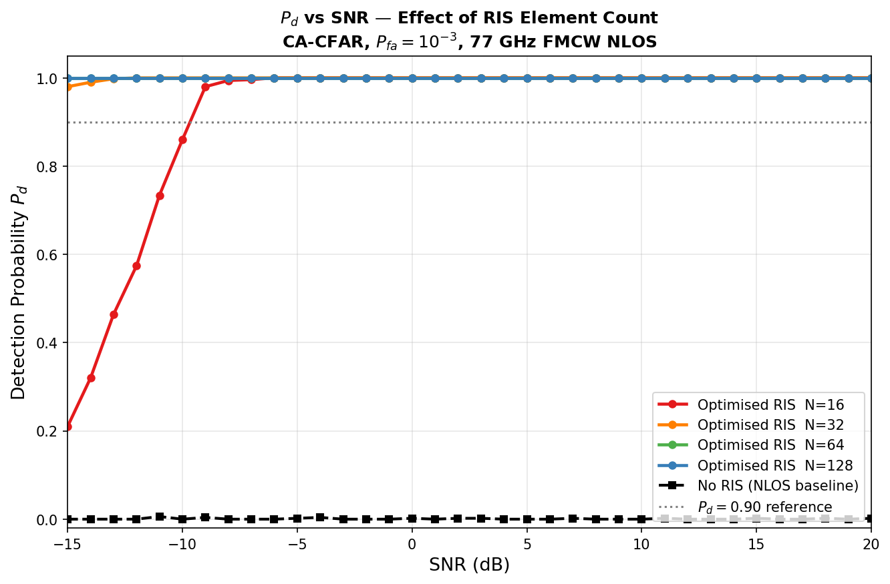
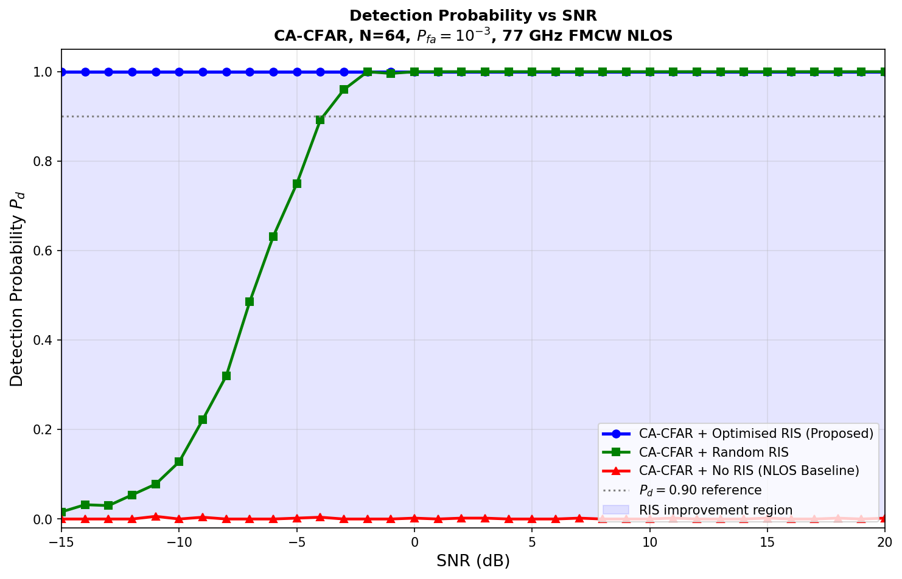
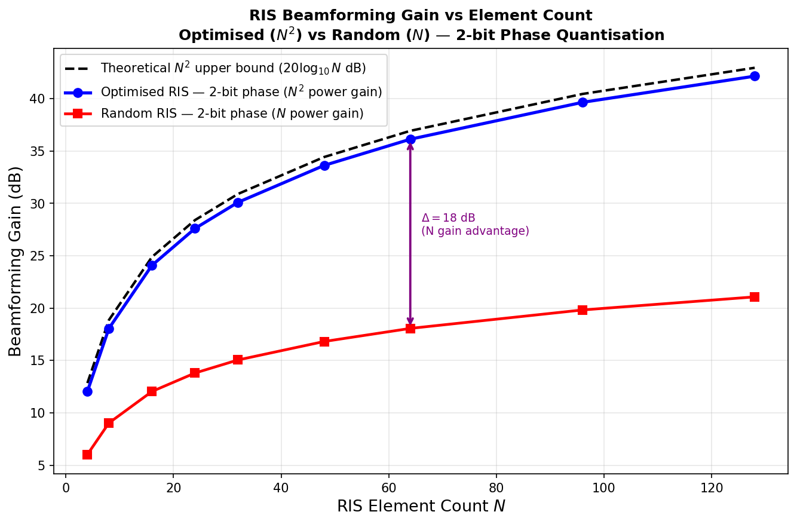
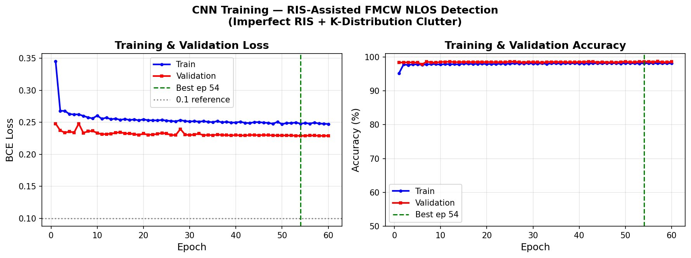
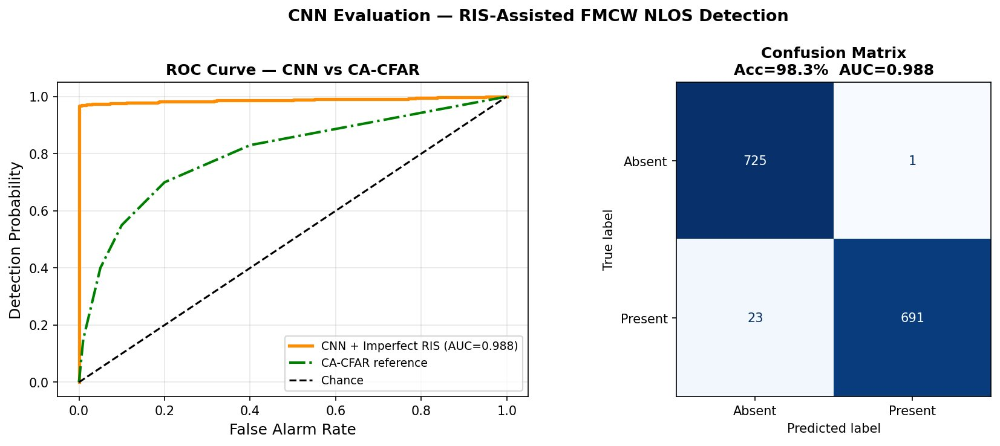

# RIS-Assisted FMCW Radar NLOS Detection

**Paper:** *RIS-Assisted FMCW Radar Target Detection in NLOS Environments via CNN-Based Range-Doppler Processing*

**Authors:**
- Yogesh Rethinapandian — University of Illinois at Chicago (yrethi2@uic.edu)
- Kaushik Kumar — University of Arizona (kaushikkumar@arizona.edu)
- Arun Karthik Sundararajan — Independent Researcher (arunkarthik.sundararajan@gmail.com)

**Submitted to:** IEEE Antennas and Wireless Propagation Letters (AWPL)

---

## Overview

This repository contains the simulation framework, dataset generation pipeline, CNN training code, and all paper figures for our work on RIS-assisted FMCW radar target detection in non-line-of-sight (NLOS) environments.

We propose a reconfigurable intelligent surface (RIS) passive antenna aperture architecture that redirects 77 GHz FMCW radar energy around physical obstructions toward NLOS targets. A 64-element RIS with 2-bit phase quantization achieves 36.1 dB coherent aperture gain, enabling CA-CFAR detection at SNR as low as −15 dB — a regime where conventional radar yields detection probability below 0.6%. A lightweight CNN trained on range-Doppler maps under realistic RIS impairment conditions achieves 98.33% test accuracy and AUC of 0.988.

---

## Key Results

| Metric | Value |
|--------|-------|
| RIS aperture gain, optimised N=64 | 36.1 dB |
| RIS aperture gain, random N=64 | 18.1 dB |
| Coherence advantage (opt. vs. rand.) | 18.0 dB |
| SNR at Pd=0.9, N=128, optimised | −15 dB |
| SNR at Pd=0.9, N=64, random | −3 dB |
| Max Pd, no RIS (CA-CFAR) | 0.006 |
| CNN test accuracy | 98.33% |
| CNN AUC | 0.988 |
| False alarm rate | 0.14% |
| Best training epoch | 54 / 60 |
| CNN trainable parameters | 336,865 |

---

## Repository Structure

```
ris-fmcw-nlos/
│
├── README.md
├── LICENSE
├── .gitignore
│
├── simulate_CFAR_RIS.py        # FMCW + RIS simulation: Pd curves, RDMs, gain analysis
├── simulate_DATASET_GEN.py     # Dataset generation with imperfect RIS impairment model
├── train_cnn_final.py          # CNN training, evaluation, ROC curve, confusion matrix
│
├── fig1_rd_maps.png            # Range-Doppler maps: No RIS / Random / Optimised
├── fig2_pd_vs_N.png            # Pd vs SNR for N = 16, 32, 64, 128
├── fig3_pd_money.png           # Optimised vs Random vs No RIS at N=64
├── fig4_gain_vs_N_fixed.png    # Beamforming gain: N² vs N aperture scaling
├── fig5_training_curves.png    # CNN training and validation loss/accuracy curves
└── fig6_roc_confusion.png      # ROC curve (AUC=0.988) and confusion matrix
```

---

## System Parameters

### FMCW Radar
| Parameter | Value |
|-----------|-------|
| Carrier frequency | 77 GHz |
| Sweep bandwidth | 500 MHz |
| Chirp period | 50 µs |
| Chirps per frame | 64 |
| ADC samples per chirp | 256 |
| Range resolution | 0.30 m |
| Velocity resolution | 0.31 m/s |

### RIS Configuration
| Parameter | Value |
|-----------|-------|
| Array geometry | 8×8 UPA (N=64 elements) |
| Element spacing | Half-wavelength |
| Phase quantization | 2-bit (0, π/2, π, 3π/2) |
| Radar-to-RIS distance d₁ | 15 m |
| RIS-to-target distance d₂ | 20 m |
| Coherent aperture gain (N=64) | 36.1 dB |

### Hardware Impairment Model
Aggregate RIS gain efficiency modelled as η ~ Beta(2,1), with mean η̄ = 2/3, producing a 3.5 dB mean reduction from the ideal N² bound and per-sample variation that drives genuine classification difficulty.

### Clutter Model
- K-distribution clutter: texture g ~ Gamma(0.5, 1), CNR = −8 dB
- 2 to 4 competing multipath reflectors within ±6 m range and ±3 m/s velocity of the target bin
- Unit-variance AWGN throughout both classes

---

## Dataset

**14,400 labeled 64×64 RDM crops** equally split between present (optimised RIS with impairments) and absent (clutter only) classes.

- SNR range: −15 to +20 dB (36 levels, 200 frames per level per class)
- Train / Validation / Test split: 80 / 10 / 10
- At −15 dB SNR: 43% sample-level class ambiguity

The dataset is not included in this repository due to size. To regenerate it from scratch, run:

```bash
python simulate_DATASET_GEN.py
```

This creates a `dataset_imperfect/` directory with `present/` and `absent/` subfolders containing `.npy` range-Doppler map crops.

---

## CNN Architecture

Three convolutional blocks (channel depths 32, 64, 128; 3×3 kernels; batch normalisation; ReLU activation; 2×2 max pooling; spatial dropout 0.3), followed by global average pooling and two fully connected layers (256 → 64 → 1) with sigmoid output. Total trainable parameters: 336,865.

### Training Configuration

| Setting | Value |
|---------|-------|
| Optimiser | Adam |
| Learning rate | 1×10⁻⁴ |
| Weight decay | 5×10⁻³ |
| LR schedule | Cosine annealing (1×10⁻⁴ → 1×10⁻⁵) |
| Label smoothing | ε = 0.1 |
| Batch size | 32 |
| Max epochs | 60 |
| Early stopping patience | 15 |
| Augmentation | Random flips, Gaussian noise σ=0.06 |

---

## Running the Code

### Requirements

```bash
pip install numpy torch torchvision matplotlib scikit-learn scipy
```

Tested on Python 3.9+, PyTorch 2.0+, macOS (MPS) and Linux (CUDA).

### Step 1 — Run simulation

```bash
python simulate_CFAR_RIS.py
```

Produces: `fig1_rd_maps.png`, `fig2_pd_vs_N.png`, `fig3_pd_money.png`, `fig4_gain_vs_N_fixed.png`

### Step 2 — Generate dataset

```bash
python simulate_DATASET_GEN.py
```

Produces: `dataset_imperfect/present/` and `dataset_imperfect/absent/`

### Step 3 — Train and evaluate CNN

```bash
python train_cnn_final.py
```

Produces: `fig5_training_curves.png`, `fig6_roc_confusion.png`, `cnn_results.json`, `best_cnn_model.pth`

---

## Figures

### Fig 1 — Range-Doppler Maps

Three configurations at SNR = 10 dB, N = 64. No RIS (a): target electromagnetically invisible. Random RIS (b): faint incoherent signature. Optimised RIS (c): sharp coherent peak at range bin 117, Doppler bin 40, exceeding the noise floor by over 15 dB.

### Fig 2 — Detection Probability vs SNR (Effect of Element Count)

CA-CFAR Pd vs input SNR for N = 16, 32, 64, 128. No-RIS baseline remains below 0.6% at all SNR levels.

### Fig 3 — Optimised vs Random vs No RIS

At N = 64, optimised RIS achieves near-perfect detection from −15 dB. Random RIS lags by 12 dB. No-RIS CA-CFAR fails completely throughout.

### Fig 4 — Beamforming Gain vs Element Count

Optimised RIS tracks the N² theoretical bound precisely (36.1 dB at N=64). Random configuration achieves N gain (18.1 dB), an 18 dB deficit attributable entirely to incoherent aperture combining.

### Fig 5 — CNN Training Curves

Training loss remains above 0.1 throughout all 60 epochs confirming label smoothing is effective. Validation loss consistently below training loss. Best epoch at 54.

### Fig 6 — ROC Curve and Confusion Matrix

AUC = 0.988, test accuracy = 98.33% on 1,440 held-out samples. 23 missed detections, 1 false alarm. False alarm rate: 0.14%.

---

## Citation

If you use this code or results in your research, please cite:

```bibtex
@article{rethinapandian2026ris,
  title={RIS-Assisted FMCW Radar Target Detection in NLOS Environments
         via CNN-Based Range-Doppler Processing},
  author={Rethinapandian, Yogesh and Kumar, Kaushik and
          Sundararajan, Arun Karthik},
  journal={IEEE Antennas and Wireless Propagation Letters},
  year={2026},
  note={Under review}
}
```

---

## License

This project is licensed under the MIT License. See `LICENSE` for details.

---

## Contact

For questions regarding the code or simulation framework, contact:

**Yogesh Rethinapandian**
Department of Electrical and Computer Engineering
University of Illinois at Chicago
yrethi2@uic.edu
